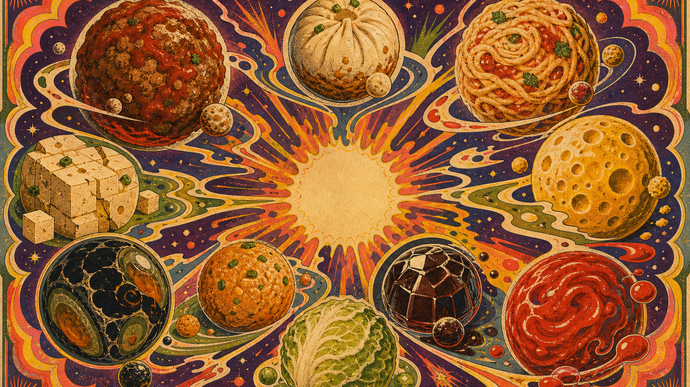
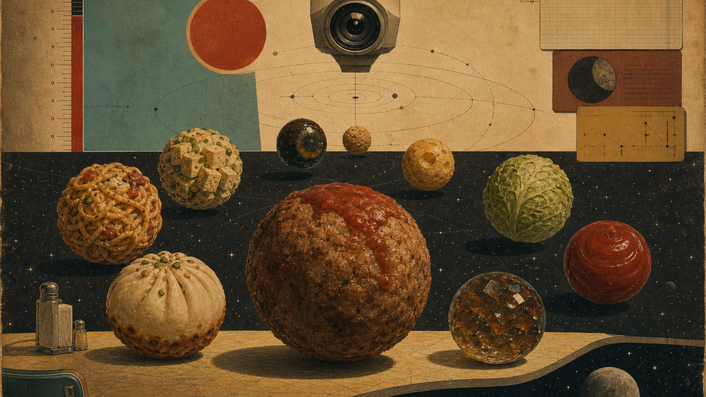

# Galaxy Food Stall

Galaxy Food Stall is a visual exploration for a food-planet 4X game: a galaxy where every world is edible, suspicious, and a little too tasty for geopolitics.

This repository currently contains concept art, reusable prompt rules, and early visual direction tests. It is intentionally small and asset-focused so the art direction can settle before game code begins.

## Current Directions

### 70s Psychedelic Poster

High-saturation screenprint energy: liquid orbital bands, radial poster hierarchy, food planets as a cosmic menu mandala, visible paper grain, halftone, and ink registration drift.

### Paranoid Sci-Fi Paperback

Vintage speculative paperback mood: domestic still life colliding with outer space, surveillance geometry, muted paper colors, uncanny calm, and edible worlds treated as impossible evidence.

## Asset Sets

- `assets/food-planets/crt-clean-16x9/` - ten no-interface CRT food planet assets.
- `assets/food-planets/crt-interface-16x9/` - ten CRT interface studies generated from the clean assets.
- `concepts/` - two stronger cover/poster style explorations.
- `design/psychedelic-sci-fi-cover/` - reusable style rules captured as a local Codex skill draft.
- `design/art-bible-hybrid-70-30.md` - canonical hybrid art bible (70 paperback / 30 psychedelic).

## Food Planet Roster

- Beef ball planet
- Shengjianbao planet
- Pasta planet
- Cheese planet
- Tofu planet
- Century egg planet
- Fried potato ball planet
- Cabbage planet
- Vinegar jelly planet
- Ketchup planet

## Canonical Direction

**Hybrid 70 / 30** is the production art direction:

- **70% Paranoid Sci-Fi Paperback** — cover hierarchy, uncanny calm, surveillance/measurement symbols, muted paper field, reality fracture.
- **30% 70s Psychedelic Poster** — local burnt-orange / acid-yellow / avocado heat, one liquid orbital band, edible organic contours.

Full bible (planets, monsters, food, UI, player-facing UAT): [`design/art-bible-hybrid-70-30.md`](design/art-bible-hybrid-70-30.md).

## Direction Notes

The CRT interface studies helped expose what does not fit: the food worlds started to feel like terminal widgets instead of a galaxy worth exploring. Do not fall back to CRT chrome.

Keep food identity readable through planetary terrain, not labels. Avoid modern UI, glossy 3D food renders, and literal parody.

## License

See [LICENSE](LICENSE).
